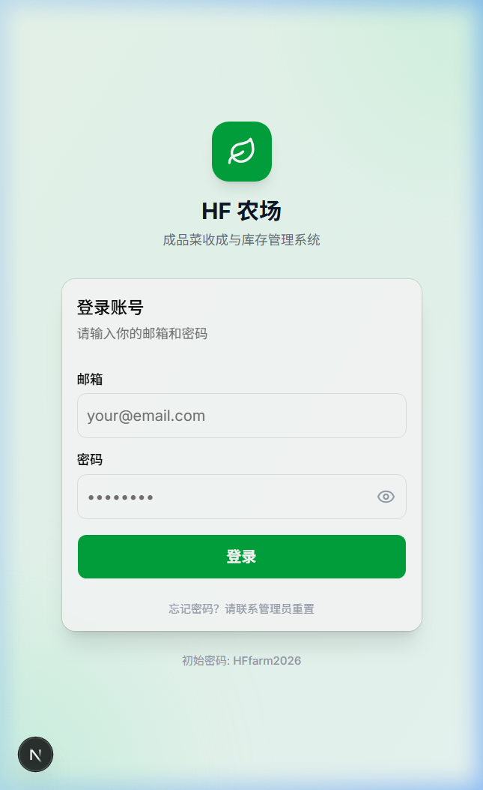
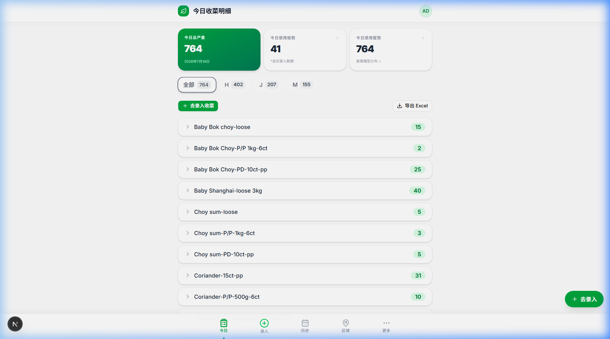
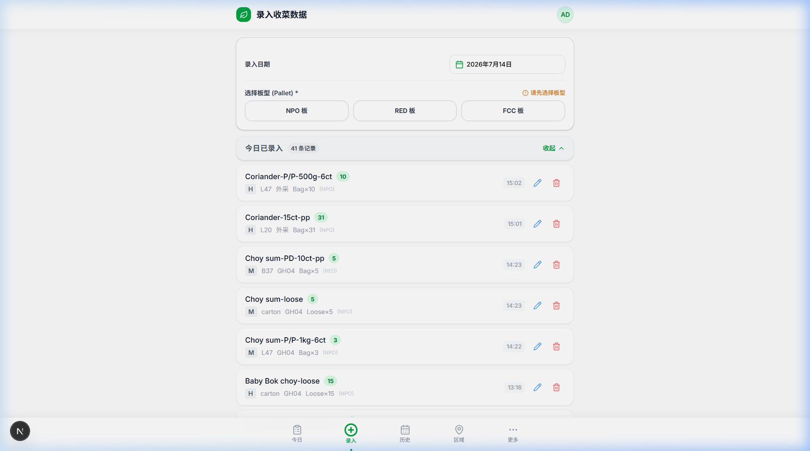
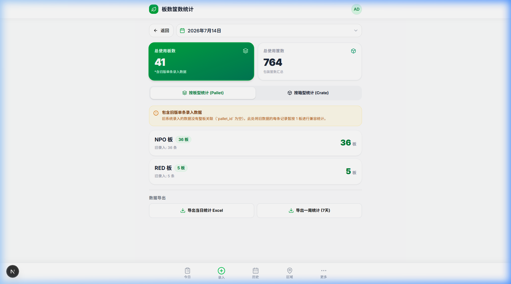
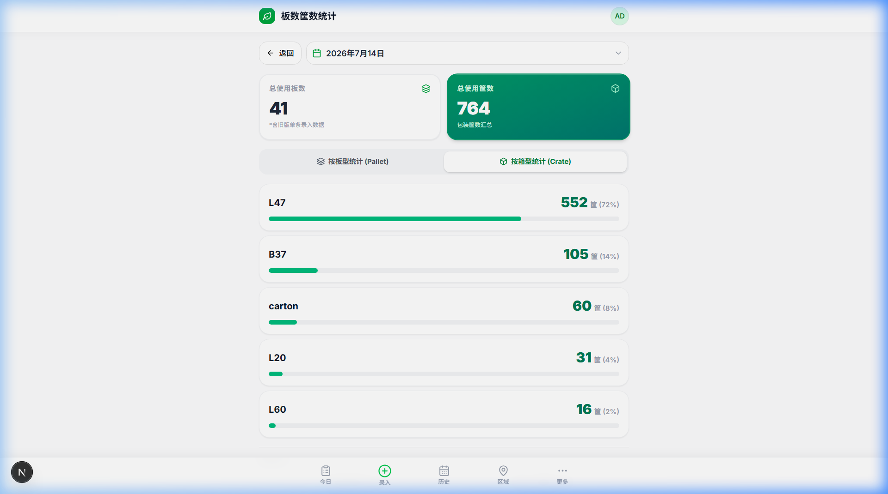
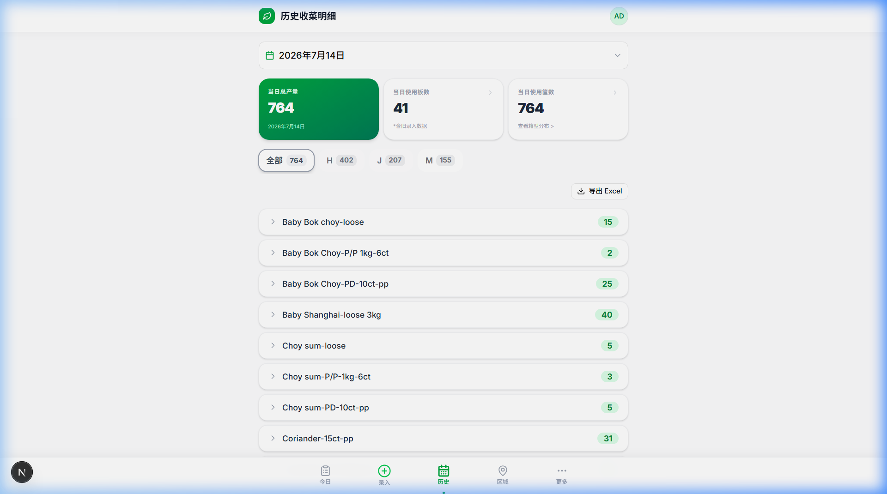
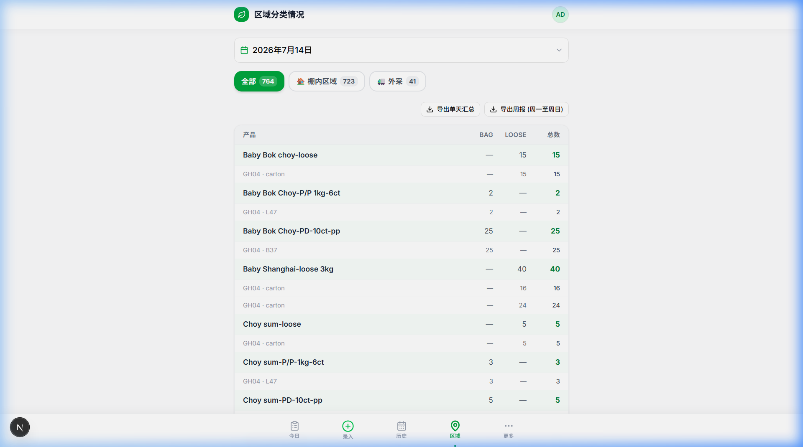
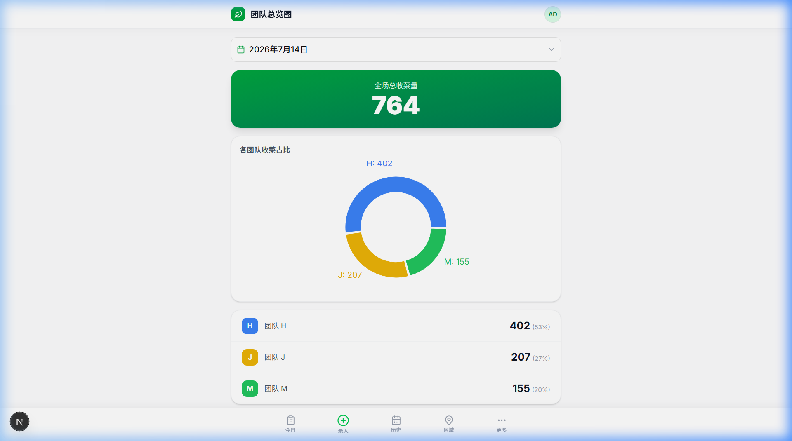
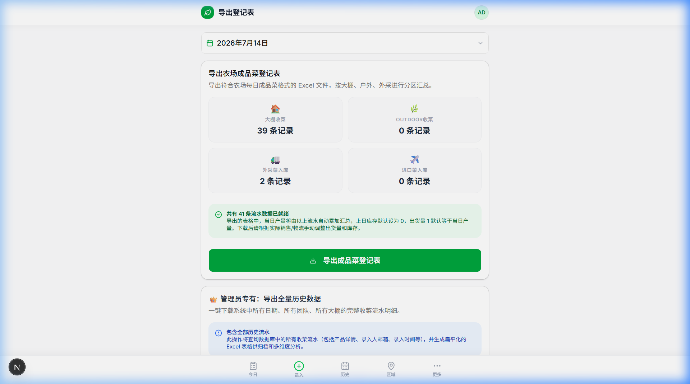

# 🌿 HF 农场成品菜管理系统 — 员工使用手册

本系统用于登记农场每日成品菜的收成、打板以及分类统计。请仔细阅读以下使用说明，方便日常顺利录入和对账。

---

## 📱 如何登录

1. 在手机或电脑浏览器中打开系统网址。
2. 输入你的**邮箱地址**和**密码**。
3. 点击「登录」。

> 💡 **初始密码**：`HFfarm2026`
> 首次登录后，建议前往「更多」→「个人设置」修改为自己的安全密码。

---

## 📋 核心功能与操作指南

### 1. 📋 今日收成看板

**位置**：底部导航栏「今日」

打开系统后的默认首页，在这里你可以看到：

- **今日总产量**：所有团队当日累计总收成数（绿色卡片）
- **今日使用板数**：当日实际使用的物理板数量 ← **点击可查看板型明细**
- **今日使用筐数**：当日总包装筐数 ← **点击可查看箱型明细**
- **团队分组**：点击团队标签（H/J/M/S/W/Y）可筛选查看各团队的产量
- **产品折叠列表**：展开后可看到每种产品的录入明细

> 💡 **提示**：板数和筐数卡片是可以点击的！点击后会跳转到**板数筐数统计明细**页面，查看每种板型和箱型的具体分布。

---

### 2. ➕ 板级数据录入

**位置**：底部导航栏「录入」或首页浮动的「去录入」按钮

系统采用**按板录入**模式，和产线实际操作流程一致：**先选板→再在板上逐个添加产品**。

#### 录入步骤：

**第一步：选择板型（Pallet）**
- 在顶部点选板型：**NPO / RED / FCC**
- ⚠️ 必须先选板型才能继续添加产品

**第二步：往板上添加产品**
1. **选择产品**：在搜索框输入产品名称模糊搜索，点击选中
2. **选择团队**：点击对应的团队标签（H / J / M / S / W / Y）
3. **选择箱型**：点击对应的箱型（L47 / B37 / L60 / carton 等）
4. **选择大棚编号**：输入或从下拉框选择（GH04、户外WF03、外采 等）
5. **选择数量类型**：Bag（包数）或 Loose（散数）
6. **输入数量**：用 +/- 按钮或直接键盘输入
7. **备注**（选填）：如有特殊情况可填写
8. 点击 **「添加到当前板」**

可以在同一板上重复此步骤，添加多种不同产品。

**第三步：确认提交**
- 检查板上已添加的产品列表无误
- 点击 **「✅ 确认提交整板」** 完成

> ⚠️ **注意事项**：
> - 录入前必须先选板型，否则无法添加产品
> - 板型、团队、箱型、大棚编号都没有默认值，必须手动指定以防误录
> - 如需录入非今天的数据，可点击录入日期进行修改

---

### 3. ✏️ 记录编辑与删除

如果录入数据有误，可以在「录入」页面或「历史」页面进行修改：

**编辑记录：**
- 在「今日已录入」列表（或历史页面）中找到需要修改的记录
- 点击记录旁的 ✏️ 编辑按钮
- 在弹出对话框中修改产品、数量、箱型等信息
- 点击「保存修改」

**删除记录：**
- 点击 🗑️ 垃圾桶图标可删除**单条**产品记录
- 点击板头部的「删除整板」可一次性删除**整板**及板内所有产品

> ⚠️ **权限说明**：
> - 普通编辑员 (Editor) 只能编辑或删除**自己录入的且是当天**的记录
> - 管理员 (Admin/SuperAdmin) 可以编辑或删除**任何人任何日期**的记录

---

### 4. 📊 板数筐数统计明细（新功能）

**位置**：点击今日/历史页面的「使用板数」或「使用筐数」卡片

#### 板型统计 Tab (Pallet)
- 展示每种板型（NPO、RED、FCC）的使用数量
- 自动区分**新版整板录入**（一板多产品）和**旧版单条录入**（一条一板）
- 如存在旧数据，会自动显示黄色提示备注

#### 箱型统计 Tab (Crate)
- 展示每种箱型（L47、B37、L60、carton 等）的总使用筐数
- 每种箱型显示数量和占比百分比
- 附可视化进度条，直观反映各箱型占比

#### 数据导出
页面底部提供两种导出选项：
- **导出当日统计 Excel**：包含板型统计和箱型统计两个工作表
- **导出一周统计 (7天)**：自动汇总近 7 天数据，生成日期 × 板型/箱型的交叉统计矩阵

---

### 5. 📅 历史数据与对账

**位置**：底部导航栏「历史」

- 点击顶部日期选择器，选择需要查看的日期
- 顶部自动显示当日的**总产量**、**使用板数**和**使用筐数**
- 板数和筐数卡片可点击，查看统计明细
- 按产品折叠浏览，点击展开可看到每条录入的具体信息
- 支持按团队筛选
- 支持**导出 Excel** 当日收成明细

---

### 6. 🏠 区域分类情况

**位置**：底部导航栏「区域」

按大棚区域自动分类汇总收成数据：
- 🏠 **棚内区域**：GH01-GH14、AF200
- 🌿 **户外WF03区域**
- 🚛 **外采**
- ✈️ **进口**

**导出功能：**
- **导出单天汇总**：每个区域分组列出各产品汇总数量
- **导出周报 (周一至周日)**：自动汇总当前周的全部数据，生成极简的两列汇总表

---

### 7. 📈 团队总览图

**位置**：底部导航栏「更多」→「团队总览图」

用饼图直观展示各团队的产出占比，帮助管理者了解各团队的工作量分布。

---

### 8. 📤 导出登记表

**位置**：底部导航栏「更多」→「导出登记表」

支持导出**农场成品菜登记表**，格式与旧版 Excel 模板完全一致，包含：
- 大棚收菜入库
- outdoor 收菜入库
- 外采菜加工入库

每个分区按产品汇总，包含 Stockcode、EXO Description、上日库存、当日产量、出货等列。

---

### 9. 👑 管理员专有功能

**位置**：底部「更多」→ 「导入数据」/「用户管理」

**数据导入：**
- 支持从 Excel 文件批量导入收成数据
- 可选择「全部强制覆盖为指定日期」，便于补单
- 自动去重：发现完全相同的数据会标记并跳过

**数据清理：**
- 可彻底清空某一天的全部数据
- 操作前会显示当天数据条数，二次确认后才执行

**用户管理：**
- 管理用户的角色和权限
- 管理员互保机制：普通管理员无法修改其他管理员的权限

**全量数据导出：**
- 导出所有历史数据，包含全部字段的完整备份

---

## 🔑 权限角色对照表

| 角色 | 板级录入 | 查看报表与导出 | 编辑/删除他人记录 | 更改用户权限 | 批量导入/删除 |
| :--- | :---: | :---: | :---: | :---: | :---: |
| 👑 **超级管理员 (SuperAdmin)** | ✅ | ✅ | ✅ | ✅ (能管 Admin) | ✅ |
| 🛡️ **管理员 (Admin)** | ✅ | ✅ | ✅ | ✅ (不能管 Admin) | ✅ |
| ✏️ **编辑员 (Editor)** | ✅ | ✅ | ❌ (只能动自己的当天记录) | ❌ | ❌ |
| 👁️ **查看员 (Viewer)** | ❌ | ✅ | ❌ | ❌ | ❌ |

---

## ❓ 常见问题 FAQ

**Q：打板时，有一筐菜是不上板的（散装或直接装车），怎么录入？**
A：对于不上板的产品，在录入时直接单独打板即可，或者先随便选一个板型，提交后由管理员或自己点进编辑修改。

**Q：板数统计为什么显示「含旧录入数据」？**
A：系统有两种录入模式——旧版（一条条单独提交）和新版（整板提交）。旧版数据没有物理板关联，系统将旧版每条记录暂按 1 板计算。当某天全部采用新版整板录入后，这个提示就不会再出现。

**Q：为什么在用户管理中我无法修改某些人的角色？**
A：系统启用了安全控制保护。所有管理员平级互保，普通管理员无法降低其他管理员的权限，只有超级管理员才可以执行此操作。

**Q：我导出的 Excel 文件怎么和以前格式不一样？**
A：区域分类汇总表已优化为只保留产品名称、包装数量、棚号及总数量。如需查看详细流水，请使用管理员专用的「导出全部历史数据」功能。

**Q：手机上看不到所有按钮怎么办？**
A：底部导航栏最右侧有一个「更多」按钮，点击后可以看到团队总览图、导出登记表、产品库、个人设置等所有功能入口。

**Q：系统支持多人同时录入吗？**
A：完全支持。系统每 30 秒自动刷新数据，不同用户可以在各自手机上同时录入，数据会自动同步到看板。

---

## 📞 系统管理与技术支持

若系统使用中遇到异常，请联系系统开发者或管理员：
- ichsh48@gmail.com
- betty.huforwork@gmail.com
